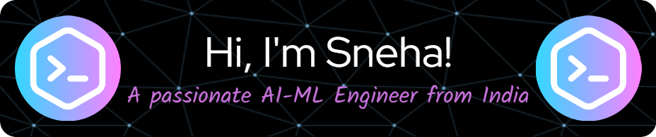

  

<table align="center">
<tr>
<td align="left">  
<h2 align="center">👩‍💻 About Me</h2>
<ul>
    <li>👩‍🎓 Persuing B.Tech in CSE (AI & ML) from Heritage Institute of Technology</li>
    <li>🧠 Currently diving deep into:
        <ul>
            <li>Agentic AI</li>
            <li>Large Language Models (LLM)</li>
            <li>Computer Vision</li>
        </ul>
    </li>
    <li>🏋️‍♀️ Regular gym-goer - staying fit is important for both body and mind</li>
    <li>🍳 Passionate about cooking and experimenting with new recipes</li>
    <li>📺 Avid anime fan – always up for a chat about the latest series or all-time classics</li>
    <li>🚀 Excited about leveraging AI to solve real-world problems and create innovative solutions</li>
</ul>
</td>
<td>

</td>
</tr>
</table>

 

<h2 align="center">🔗 Connect with me</h2>

  &nbsp;&nbsp;
  &nbsp;&nbsp;
  &nbsp;&nbsp;
  

 

<h2 align="center">💻 Tech Stack</h2>

  <h3>Languages</h3>
  
  
  <h3>Frameworks & Libraries</h3>
  
  
  <h3>AI/ML & Data Science</h3>
  
  
  <h3>Tools & Platforms</h3>
  

 

<h2 align="center">📊 Github Stats</h2>

<table align="center">
<tr><td align="center">

</td><td>

</td></tr>
<tr><td colspan="2" align="center">
    

</td></tr></table>

 

<h2 align="center">🚀 Featured Projects</h2> 

<table align="center" cellspacing="3"><tr><td>
    

</td><td>

</td></tr><tr><td>

</td><td>

</td></tr>

<tr>
    <td align="center" colspan="2"><b>Show some ❤️ by starring some of the repositories⭐!</b></td>
</tr></table>

 

    

